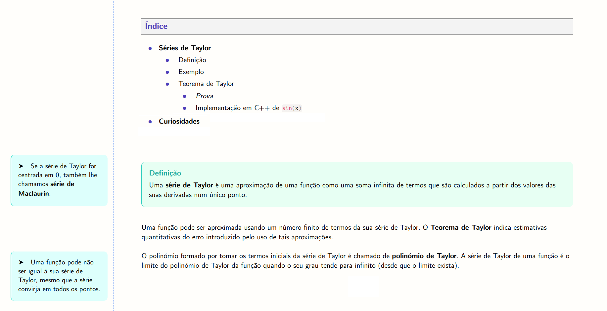
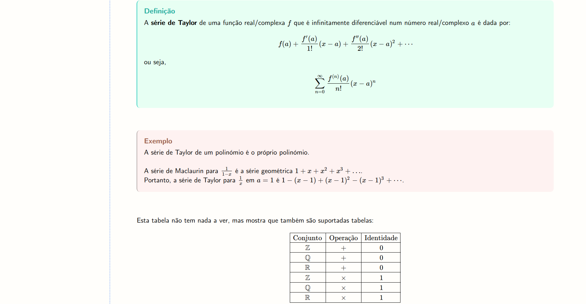

# Notebook
A language for easily creating beautiful documents, mainly study notes.

### Install / Uninstall
- To install the `notebook` command, run `install.sh`
- To uninstall, run `uninstall.sh`

### Prepare directory for a new project
1. Navigate to the project directory.
2. Run `notebook -i` to initialize the directory and copy the dependencies. This way the directory is ready to host a new project.

### Parse a source file
1. Navigate to the project directory.
2. Write the source file (in this example, `source.nb`).
3. Run `notebook -p source.nb`. The document `source.html` is produced.
